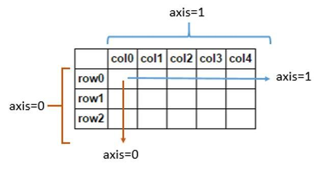

对于 numpy 或者 pandas 初学者来说，axis 是比较难以理解的。

首先来看一下 StackOverflow 上的解释：
> By default axis=0 . This is consistent with the numpy.mean usage when axis is specified explicitly (in numpy.mean , axis==None by default, which computes the mean value over the flattened array) , in which axis=0 along the rows (namely, index in pandas), and axis=1 along the columns.

译文：
> （在pandas中）axis 的默认取值是 0，用法与 numpy.mean 一致。当 axis 被明确指定时（在 numpy.mean 中，axis 的默认值是 None，表示计算所有维度的全部数据的平均值），axis=0 表示沿着诸行（rows）的方向执行（即 pandas 中的 index），axis=1 表示沿着诸列（columns）的方向执行。

还有一种解释是：
> 轴用来为超过一维的数组定义的属性，二维数据拥有两个轴：第 0 轴沿着诸行的方向垂直往下，第 1 轴沿着诸列的方向水平延伸。

示意图如下：


上面的解释看似清晰严谨，但是在使用时还是很容易感到困惑。所以我们结合代码来理解一下其中含义。

**【代码 1】**
``` python
>>> import numpy as np
>>> narr = np.array([[1, 2, 3], [7, 8, 9]])
>>> print(narr)
[[1 2 3]
 [7 8 9]]

>>> print(narr.mean())  
5.0
```
可见，在 numpy 中未指定 axis（默认是 None）时，计算的是所有维度（事例中是 2 维）、所有数据的平均值（即 1、2、3、7、8、9的平均值）。


**【代码 2】**
``` python
>>> print(narr.mean(axis=0))  
[4. 5. 6.]
```
这里指定 axis 为 0（同'index'），表示沿着诸行（rows）的方向来计算平均值。**即计算每一列上所有行的平均值，也就是每一次计算均值（这里有 3 列，所以可以理解为计算了 3 次）时，都是将每一行（rows，垂直方向）的数据遍历了一遍**。以第一列为例，总共有 2 行，数据分别是：1、7，所以第一列的平均值是 4。


**【代码 3】**
``` python
>>> print(narr.mean(axis=1))  
[2. 8.]
```
道理同上，这里指定了 axis 为 1（同'columns'），表示沿着诸列（columns）的方向计算平均值。**即计算每一行上所有列的平均值，也就是每一次计算均值（这里有 2 行，所以可以理解为计算了 2 次）时，都是将每一列（columns，水平方向）的数据遍历了一遍**。


**【代码 4】**
``` python
>>> import pandas as pd
>>> df = pd.DataFrame({'A': [1, 7], 'B': [2, 8], 'C': [3, 9]})
>>> print(df)
   A  B  C
0  1  2  3
1  7  8  9

>>> print(df.mean())
A    4.0
B    5.0
C    6.0
dtype: float64
```
这里换做 panda 中的 DataFrame，axis的默认值是 0（同'index'），所以原理同【代码 2】。


**【代码 5】**
``` python
>>> print(df.mean(axis=1))
0    2.0
1    8.0
dtype: float64
```
这里 axis 被指定为 1（同'columns'），原理同【代码 3】。


**【代码 6】**
``` python
>>> df.index = ['A', 'B']
>>> print(df)
   A  B  C
A  1  2  3
B  7  8  9

>>> print(df.drop('A', axis=1))
   B  C
A  2  3
B  8  9
dtype: float64
```
对比【代码 5】，这里比较让人困惑。我们特意将 df 的 index 改为['A', 'B']。pandas 官网上对 drop 的 axis 参数的解释是：
> Whether to drop labels from the index (0 or ‘index’) or columns (1 or ‘columns’).

这里 axis 被设置为 1（同'columns'），**所以将名为'A'的列删除**。更详细地说：沿着诸列（columns，水平）的方向遍历，找到名为'A'（这里是列名）的值，将其一一删除。